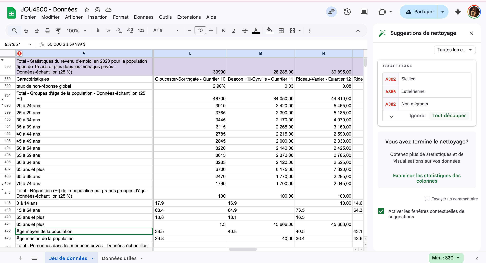
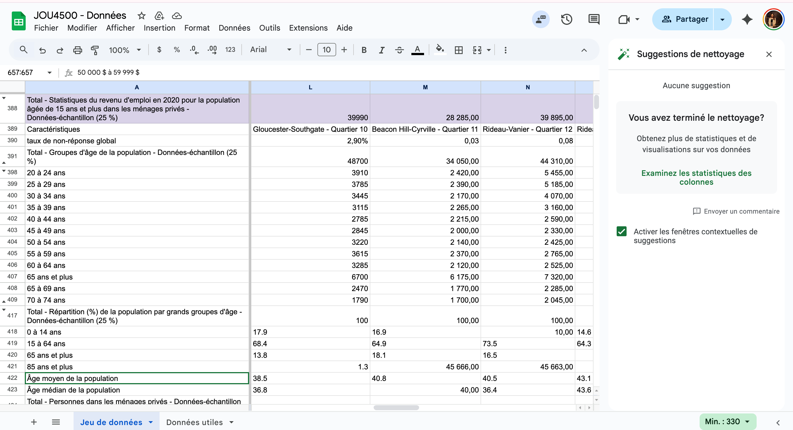
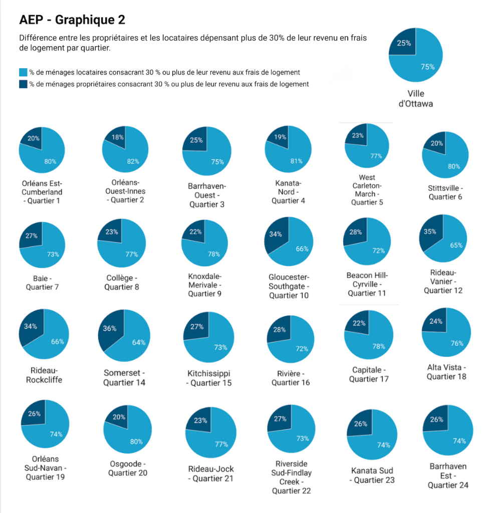

**11 Novembre 2025**<br>
**JOU4500 et Journalisme Numérique II**<br>
**Nikita Scholz, Dania Maisonneuve, Kelli-Anne Piché**<br>
**Présenté à Jean-Sébastien Marier**<br>

# Analyse exploratoire de données (AED) et proposition

## 1. Introduction

Notre but pour ce travail est d’analyser la réalité du logement selon les différents quartiers d’Ottawa. Nous tenterons de répondre à la question: est-il plus avantageux d’être propriétaire ou locataire à Ottawa selon les prix des logements?<br>
Nous utiliserons le jeu de données collecté par Statistique Canada dans le cadre des initiatives de transparence municipale. Ce jeu de données contient plusieurs types de renseignements : les prix médians des propriétés, les loyers moyens, ainsi que d’autres informations socioéconomiques par quartier. <br>
L’analyse que nous tenterons de faire sera séparée en 3 étapes. La première sera de nettoyer le jeu de données pour s’assurer de garder seulement l’essentiel pour nos recherches. Ensuite, nous analyserons la position des locataires et celle des propriétaires pour comparer laquelle sont plus avantageuses pour un citoyen. La dernière étape sera alors d'interpréter les résultats pour répondre à notre question de départ.


## 2. Obtenir les données
**Expliquer comment importer les données dans google feuilles de calcul**<br>
Tout d’abord, nous sommes allés dans les instructions de l’analyse exploratoire et nous avons cliqué double sur utiliser ce fichier CSV et ensuite on a sélectionné télécharger le fichier lié. Ensuite, après l’avoir téléchargé dans les téléchargements, nous avons été dans Google feuilles de calcul et on a ouvert une nouvelle feuille de calcul. Par la suite, on a sélectionné l’option Fichier et ensuite importer. On est allé dans téléverser et on a glissé le téléchargement des données. Finalement, nous avons pesé sur l'importation des données. 


https://docs.google.com/spreadsheets/d/1lzWKCiK3wRbvcReweSwHE6eMn_tIX7ZD1PHe1a8lKak/edit?usp=sharing 


**Faites des observations générales concernant le jeu de données :**

Dans le jeu de données, il y a 26 colonnes et 2503 lignes. À première vue, les données n’étaient pas propres et n’étaient pas très bien organisées. Nous avons aussi remarqué qu’il y beaucoup de données qui nous étaient peu utiles ou mêmes absentes. Ensuite, notre équipe à fait comme observation qu’il y a beaucoup de données quant aux âges, aux langues, aux immigrants, aux types de voitures, des types de logements et aux types de revenus. Finalement, nous avons aussi remarqué et on a été très déçu du fait qu’il n'y a pas de données par rapport au Québec, tandis que le texte discutait de la relation entre travailler en Ontario et habiter au Québec et vis versa.

 Dans notre jeu de données, nous avons affaire avec différents types de variables. Tout d’abord, dans notre jeu de données utile pour notre histoire, les frais de logement de la colonne A (1-5) représentent des variables quantitatives continues. Ensuite,  les % des ménages propriétaires ou locataires, de la colonne A (7-8) représentent aussi des variables continues. Pour ajouter, le restant de nos données, ce sont aussi des variables quantitatives continues. Les titres des colonnes B à Z sont plutôt des variables qualitatives nominales.

**Formulez au moins une question ou une hypothèse qui vous vient à l’esprit lorsque vous examinez les données brutes.**

Est-ce que ça vaut plus la peine d'être locataire plutôt que propriétaire dans la ville d’ottawa?


## 3. Comprendre les données

### 3.1. Analyse VIMA

Nous avons fait notre analyse VIMA sur l’ensemble des caractéristiques liées à notre sujet, comme les frais de logement et les revenus des ménages. Lorsque nous avons téléversé ces données dans notre nouvelle feuille de calcul « Données utiles », nous avons tout de suite remarqué quelques détails.

D’abord, plusieurs données avaient des erreurs de formatage. À titre d’exemple, les valeurs dans la ligne 7 n'étaient pas formatées de la même façon. Certaines de ces données étaient des chiffres alors que d’autres étaient des dates. De plus, nous avons remarqué que les colonnes M et N présentaient souvent des erreurs de formatage majeures (dans l’ensemble du jeu de donnée), ce qui rendait parfois nos valeurs aberrantes ou invalides. Par exemple, la valeur de la cellule M:7 affiche le chiffre 45 994, alors que cette ligne est censée afficher un pourcentage. Les autres données de cette même ligne font une moyenne de 10,15 %. Par conséquent, la valeur de 45 000 % ressort du lot et est impossible dans ce contexte. Nous avons donc nettoyé ces données pour ensuite faire des analyses plus poussées.

À premier coup d'œil, les données des lignes que nous avons ciblées semblent toutes être valides. Il n’y a pas de données manquantes et il ne semble pas y avoir de données invalides ou aberrantes. Afin de confirmer ce constat, nous avons produit un premier graphique, comme le suggère Statistique Canada pour assurer la qualité des données (2020). Le graphique ci-dessous, portant sur les lignes 7 et 8, nous a permis de confirmer qu’il n’y a évidemment pas de valeur aberrante. De plus, aucune valeur invalide ne fut soulevée. 


Bref, au terme de notre analyse, les données semblent valides et exactes. 

### 3.2. Nettoyage des données

Nous avons utilisé l’outil de nettoyage de Google Feuille de calcul pour enlever tout espace non nécessaire, uniformiser la présentation des données, mettre tous les résultats sous le même format et supprimer certains doublons. Une fois le nettoyage complété, l’outil nous a clairement indiqué que tout était conforme et qu’aucune donnée manquante ou erronée n’était présente dans le jeu de données, assurant ainsi la fiabilité et la cohérence de notre analyse. 





Une fois cela complété, nous avons téléversé les lignes 757, 759, 760, 761, 762, 765, 767, 768 ainsi que les lignes 1951 à 1956 dans une nouvelle feuille. Par la suite, grâce à la fonction ci-dessous, nous avons inversé les lignes et les colonnes afin de pouvoir mettre des filtres sur les différentes caractéristiques. 

```
=TRANSPOSE('Données utiles'!A1:Z28)
```

Nous avons également figé certaines lignes et colonnes afin de faciliter la lecture du tableau lors de notre travail. Enfin, nous n’avons pas eu recours à des fonctions comme SPLIT ou CONCATENER. Nous ne trouvions pas d’utilité pour ces fonctions dans le jeu de données dont nous avions besoin.


### 3.3. Analyse exploratoire des données (AED)

Nous avons concentré notre analyse exploratoire sur les deux variables suivantes : 
* % de ménages locataires consacrant 30% ou plus de leur revenu aux frais de logement
* % de ménages propriétaires consacrant 30% ou plus de leur revenu au frais de logement

À notre avis, il s’agit des meilleures variables pour nous aider à comprendre s’il est plus avantageux d’être propriétaire ou locataire à Ottawa. C’est une chose que les prix des logements soient élevés ou non, mais il en est tout autre si les individus doivent dépenser 30% ou plus de leur salaire en frais de logement, ce qui leur laisse moins d’argent pour d’autres dépenses essentielles. Par conséquent, les termes “propriétaires” et “locataires” dans la suite de cette section (3.3.) feront toujours référence à ceux consacrant 30 % ou plus de leur revenu aux frais de logement.

Le fil conducteur de notre récit nous est apparu comme une évidence. Dès notre analyse VIMA, nous avons remarqué la différence marquante entre les locataires et les propriétaires dans chaque quartier. Nous avons produit un nouveau graphique à barres regroupées afin de mieux illustrer la comparaison (Statistique Canada, 2021). Ces statistiques ont suscité en nous plusieurs questions. Nous tenterons donc de mieux comprendre ce phénomène lors de notre récit. 


Voulant mieux comprendre la situation dans chaque quartier, nous nous sommes principalement servis de notre tableau pour obtenir de nouvelles informations. L’usage d’un tableau croisé ne semblait pas pertinent avec nos types de données. 

Nous avons d’abord utilisé la formule suivante pour connaître la différence exacte entre les ménages propriétaires et locataires au sein de chaque quartier. 

```
=H_-G_
```

À l’aide de l’outil filtre, nous avons été en mesure de déterminer **les 5 quartiers avec les plus grandes différences** : 
1. Quartier 4 - Kanata-Nord (34,70)
1. Quartier 6 - Stittsville (29,80)
1. Quartier 1 - Orléans Est-Cumberland (29,40)
1. Quartier 20 - Osgoode (28)
1. Quartier 2 - Orléans-Ouest-Innes (27,80)

Nous avons également filtré les colonnes G et H afin de connaître les quartiers où les locataires et les propriétaires sont plus nombreux à dépenser 30% ou plus de leur revenu en frais de logement.

**Locataires dépensant plus de 30% de leur revenu aux frais de logement**
1. Quartier 4 - Kanata-Nord
1. Quartier 6 - Stitsville
1. Quartier 1 - Orléans Est-Cumberland
1. Quartier 12 - Rideau-Vanier
1. Quartier 17 - Capitale

**Propriétaires dépensant plus de 30% de leur revenu aux frais de logement**
1. Quartier 12 - Rideau-Vanier
1. Quartier 14 - Somerset
1. Quarter 13 - Rideau-Rockcliffe
1. Quartier 10 - Gloucester-Southgate
1. Quartier 22 - Riverside Sud-Findlay Creek

Ensuite, puisque les graphiques circulaires permettent de représenter des proportions sur une échelle de 100% (Statistiques Canada, 2021), nous les avons utilisés afin d’analyser la relation entre les propriétaires et les locataires au sein d’un même quartier. Cependant, les statistiques sont similaires à celles énumérées ci-dessus, seulement dans des ordres différents.



Nous voulions ensuite savoir si l’aspect géographique pouvait révéler quelque chose. Cette map semble indiquer que les différences entre les locataires et les propriétaires sont moins prononcées dans le centre de la ville, alors qu’il semble plus élevé dans les extrémités est et ouest. Bref, un autre angle intéressant sur lequel on pourra se tourner.


C’est ce qui conclut notre analyse exploratoire. De toute évidence, une analyse plus poussée des données reste nécessaire afin de voir si d’autres variables pourraient expliquer cette différence. 


## 4. Récit potentiel

Les articles suivants vont nous permettre de comprendre la situation des logements au Canada mais plus spécifiquement à Ottawa. Afin de vraiment raconter une histoire et bien comprendre nos données, on doit comprendre la situation de logement afin d'avoir des informations précises sur plusieurs aspects qui peuvent influencer les choix des locataires ou propriétaires. Nous avons trouvé principalement des articles de journaux et des articles sur des sites de logements. Dans notre cas, ce sont des sources assez pertinentes, car elles viennent de journalistes et de professionnels dans le domaine du logement. Pour notre projet, nous examinons s’il est plus avantageux d’être propriétaire ou locataire à Ottawa selon les prix des logements, donc toutes ces sources seront des informations qui vont nous permettre de bâtir une conclusion concise et bien soutenue.  

**Source:**
Desjardins, S. (2025, February 11). Louer ou acheter: devenir propriétaire n’est pas un choix logique. Le Journal De Montréal. https://www.journaldemontreal.com/2025/02/09/louer-ou-acheter-devenir-proprietaire-nest-pas-un-choix-logique 

Du Canada Statistique Canada, G. (2021, September 2). Les statistiques : le pouvoir des données! https://www150.statcan.gc.ca/n1/edu/power-pouvoir/toc-tdm/5214718-fra.htm 

Eads, D. (2016, October 15). How to “interview” a big pile of data. NPR. https://www.npr.org/sections/npr-training/2025/05/29/g-s1-67278/how-to-interview-a-big-pile-of-data 

Info, R. (2025, February 25). Élections en Ontario : la crise du logement vue par les candidats de la région d’Ottawa. Radio-Canada. https://ici.radio-canada.ca/nouvelle/2143463/logement-ontario-ottawa-crise-election   

Malone, K. (2025, April 15). Are Ottawa condos a good investment in 2025? Here’s what you need to know — Matt Richling - Ottawa Condos and Lofts - Ottawa Real estate for sale. Matt Richling - Ottawa Condos and Lofts - Ottawa Real Estate for Sale. https://www.mattrichling.com/blog/are-ottawa-condos-a-good-investment-in-2025-heres-what-you-need-to-know 

Ottawa, J. P.-. R. I. K., & Polonski. (2023, November 14). Meet Jason Polonski – Kanata & Ottawa’s trusted real estate agent. Jason Polonski- Realtor in Kanata, Ottawa. https://ottawarealtyman.com/renting-vs-buying-in-ottawa/?srsltid=AfmBOopRTPe0wguJu-6BidNu77JeIqpCF0Rhsw_c5KqrPSvv65isi5a4 

https://www.cpacanada.ca/fr/nouvelles/analyse/acheter-louer 


**De quoi avez-vous besoin pour raconter cette histoire?**

Afin que notre analyse soit complète et solide, nous avons quelques aspects à explorer;
Témoignage de citoyens
Nous pourrions aller chercher des témoignages pour avoir des expériences vécues de locataires et propriétaires. Avoir des témoignages de différents quartiers pourrait aussi nous aider à comparer les écarts de réalités.
Politiques locales
Qu’est-ce que la ville fait pour aider ses citoyens? Quelles sont les mesures mises en place? Nous pourrions aussi creuser davantage dans les règlements de zonage ou même de projet récent, comme la densification près des stations O-Train.
Visualisation des données
Pour mieux comprendre notre analyse, nous allons créer des cartes interactives des prix médians et des loyers moyens, des graphiques qui vont comparer l’évolution du coût du logement et le revenu médian. De plus, nous allons pouvoir utiliser le graphique split bar pour voir clairement les différences entre locataire et propriétaire.


**Qui pourriez-vous interviewer à ce sujet?**

Nous pourrions interview:
1. Citoyens 
1. Des locataires et propriétaire dans différents secteurs d’Ottawa
1. Agent de terrain
1. Des courtiers immobiliers ou gestionnaire d’immeubles pour discuter du marché
1. Experts ou chercheur
1. Professeur en urbanisme à l’université d’Ottawa: Carolyn Whitzman
1. Analystes de la SCHL: encore à trouver…


## 5. Conclusion

**Qu’est-ce qui vous a semblé le plus difficile en accomplissant ce travail?**<br>
Ce qui nous a semblé le plus difficile en accomplissant ce travail, c’était surtout l’analyse VIMA, le nettoyage des données et aussi de tout téléverser notre travail dans GitHub/visual code. Nous avons trouvé ça difficile principalement, car nous sommes toutes nouvelles dans le domaine du codage et il y avait beaucoup de données aussi, ce qui complique la compréhension. 

**Quel a été l’aspect le plus gratifiant?**<br>
L’aspect le plus gratifiant était le nettoyage des données et de téléverser nos données dans GitHub/Visual code. Lorsque nous avons réussi à téléverser notre travail dans Github/Visual code, c'était le moment qu’on s’est senti le plus fier, car on réalisait que l'on comprend enfin comment coder.

**Offrez quelques réflexions finales critiques:
Avez-vous identifié des lacunes dans vos propres connaissances?**<br>
Lors de notre analyse exploratoire des données, nous aurions aimé pouvoir identifier une corrélation entre nos variables que nous analysions (% de ménages propriétaires ou locataires dépensant plus de 30% de leur revenu en frais de logement) et d’autres variables, tels que le prix moyen des loyers. 

**Qu’auriez-vous pu faire différemment?** <br>
À notre avis, notre travail s’est bien passé. On trouve que nous avons trouvé toutes les informations nécessaires pour notre analyse et nous avons réussi à tout compléter. Entre autres, nous avons réussi à séparer les parties pour que tout le monde travaille sur un élément important de l’analyse et on s’est réunis afin de tout mettre les informations ensemble. Bref, selon nous, notre analyse n’aurait pas pu être faite différemment, car elle est déjà complète. 


## 6. Références

**Lectures obligatoires:**
Du Canada Statistique Canada, G. (2021, September 2). Les statistiques : le pouvoir des données! https://www150.statcan.gc.ca/n1/edu/power-pouvoir/toc-tdm/5214718-fra.htm 

Statistique Canada. (2020, 23 septembre). *Exactitude et validation des données : méthodes pour assurer la qualité des données*. Statistique Canada. https://www.statcan.gc.ca/fr/afc/litteratie-donnees/catalogue/892000062020008 

Eads, D. (2016, October 15). How to “interview” a big pile of data. NPR. https://www.npr.org/sections/npr-training/2025/05/29/g-s1-67278/how-to-interview-a-big-pile-of-data 

**Sources:**
Desjardins, S. (2025, February 11). Louer ou acheter: devenir propriétaire n’est pas un choix logique. Le Journal De Montréal. https://www.journaldemontreal.com/2025/02/09/louer-ou-acheter-devenir-proprietaire-nest-pas-un-choix-logique 

Info, R. (2025, February 25). Élections en Ontario : la crise du logement vue par les candidats de la région d’Ottawa. Radio-Canada. https://ici.radio-canada.ca/nouvelle/2143463/logement-ontario-ottawa-crise-election   

Malone, K. (2025, April 15). Are Ottawa condos a good investment in 2025? Here’s what you need to know — Matt Richling - Ottawa Condos and Lofts - Ottawa Real estate for sale. Matt Richling - Ottawa Condos and Lofts - Ottawa Real Estate for Sale. https://www.mattrichling.com/blog/are-ottawa-condos-a-good-investment-in-2025-heres-what-you-need-to-know 

Ottawa, J. P.-. R. I. K., & Polonski. (2023, November 14). Meet Jason Polonski – Kanata & Ottawa’s trusted real estate agent. Jason Polonski- Realtor in Kanata, Ottawa. https://ottawarealtyman.com/renting-vs-buying-in-ottawa/?srsltid=AfmBOopRTPe0wguJu-6BidNu77JeIqpCF0Rhsw_c5KqrPSvv65isi5a4 

https://www.cpacanada.ca/fr/nouvelles/analyse/acheter-louer 


